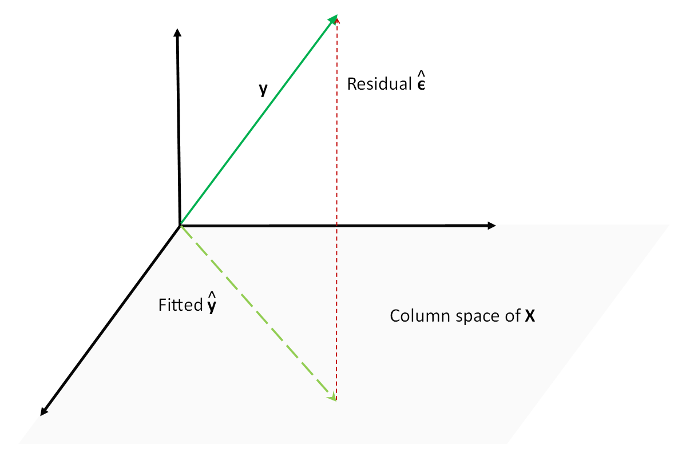

::: {.copyright-notice}
**Copyright Notice.** Planned for publication in 2026 by R. Douglas Martin, Thomas K. Philips, Bernd Scherer, and Kirk Li. All rights reserved. © Copyright 2025.
:::

::: {.pdf-callout}
::: {.pdf-icon}
&#128196;
:::
::: {.pdf-text}
**Full appendix available as PDF.**
[Download Appendix B — Probability & Statistics for PCRA](Appendix%20B%20ProbStat%20for%20PCRA.pdf){target="_blank"}
:::
:::

## Overview

This appendix assembles the probability and statistics results that underpin portfolio construction and risk management. It covers the distributional families used to model asset returns, the estimation methods used to calibrate those models, and the asymptotic theory needed to make inference about estimated quantities.

---

## B.1 — Location and Scale Distributions

::: {.section-list}
**Topics covered:**

- General location-scale family: CDF $F\!\left(\tfrac{r-\mu}{s}\right)$ and density $\tfrac{1}{s}f\!\left(\tfrac{r-\mu}{s}\right)$
- Normal distribution
- Student's $t$-distribution (including Cauchy as special case)
- Laplacian (two-sided exponential) distribution
:::

The **location-scale family** provides a unified framework for modeling asset returns. The normal distribution is the canonical member, but financial returns exhibit heavier tails, motivating the $t$-distribution with $\nu$ degrees of freedom:

$$
f_R(r) = \frac{\Gamma\!\left(\tfrac{\nu+1}{2}\right)}{\Gamma\!\left(\tfrac{\nu}{2}\right)\sqrt{\pi\nu\tau^2}} \left(1 + \frac{1}{\nu}\frac{(r-\mu)^2}{\tau^2}\right)^{-\frac{\nu+1}{2}}.
$$

Heavy-tailed distributions such as the $t$ motivate the robust estimation methods developed throughout PCRA.

---

## B.2 — Invariance Properties

::: {.section-list}
**Topics covered:**

- Mean and standard deviation equivariance under affine transformation
- Covariance translation invariance and scale equivariance
- Correlation invariance under affine transformation
:::

---

## B.3 — Linearity of Covariances

---

## B.4 — Estimator Bias, Variance, and Mean Squared Error

::: {.section-list}
**Topics covered:**

- Unbiased vs. biased estimators
- Estimator mean squared error (MSE): $\mathrm{MSE}(\hat\theta) = \mathrm{Var}(\hat\theta) + \mathrm{Bias}^2(\hat\theta)$
:::

---

## B.5 — Least Squares

::: {.section-list}
**Topics covered:**

- Ordinary Least Squares (OLS): coefficient estimates, fitted values, residuals
- Weighted Least Squares (WLS)
- Generalized Least Squares (GLS)
- Inference under normally distributed errors: $F$-tests, $t$-tests, confidence intervals
- The Gauss–Markov Theorem: BLUE property of OLS
:::

The OLS estimator in the model $\mathbf{y} = \mathbf{X}\boldsymbol{\beta} + \boldsymbol{\varepsilon}$ is
$$
\hat{\boldsymbol{\beta}}_{\mathrm{OLS}} = (\mathbf{X}^\prime \mathbf{X})^{-1} \mathbf{X}^\prime \mathbf{y},
$$
with fitted values $\hat{\mathbf{y}} = \mathbf{X}\hat{\boldsymbol{\beta}}_{\mathrm{OLS}} = \mathbf{H}\mathbf{y}$ where $\mathbf{H} = \mathbf{X}(\mathbf{X}^\prime\mathbf{X})^{-1}\mathbf{X}^\prime$ is the hat matrix.

::: {#fig-ols layout-ncol=1}
{fig-alt="OLS fit with residual plot"}

OLS fit with residuals for a simple linear regression.
:::

---

## B.6 — Minimum Mean Squared Error (MMSE) Predictors

::: {.section-list}
**Topics covered:**

- MMSE predictors of a scalar random variable
- Linear MMSE (LMMSE) predictors
- Optimality and MSE of the LMMSE predictor
- Conditional distribution of a multivariate normal
:::

---

## B.7 — Estimators via the Plug-In Principle

---

## B.8 — Maximum Likelihood Estimators

::: {.section-list}
**Topics covered:**

- Location and scale MLEs
- Regression model MLEs
- Covariance matrix MLEs
:::

Maximum likelihood estimation in location-scale models produces the score functions (derivatives of the log-likelihood) known as $\psi$ functions in robust statistics. The MLE under a normal model yields the sample mean and variance; under heavier-tailed models it yields M-estimators with bounded influence.

::: {#fig-mle layout-ncol=1}
{fig-alt="MLE rho and psi plots"}

MLE $\rho$ (loss) and $\psi$ (score) functions for location-scale estimation.
:::

---

## B.9 — Useful Inequalities

---

## B.10 — Limit Theorems

::: {.section-list}
**Topics covered:**

- Convergence of random variables: in probability, almost surely, in $L^p$
- Convergence in distribution
- Slutsky's Theorem
- Central Limit Theorem (CLT)
:::

---

## B.11 — Estimator Asymptotic Results

::: {.section-list}
**Topics covered:**

- Consistent estimators
- Estimator asymptotic variance
:::

---

## B.12 — Delta Methods

::: {.section-list}
**Topics covered:**

- Univariate delta method: $\sqrt{n}(g(\hat\theta) - g(\theta)) \xrightarrow{d} \mathcal{N}(0,\, [g^\prime(\theta)]^2 \sigma^2)$
- Bivariate delta method
:::

---

## B.13 — Estimator Standard Errors

---

## B.14 — Fisher Information and MLE Asymptotic Optimality

$$
\mathcal{I}(\theta) = \mathrm{E}\!\left[\left(\frac{\partial}{\partial\theta}\log f(X;\theta)\right)^{\!2}\right]
$$

The Cramér–Rao lower bound states that no unbiased estimator can have variance below $1/\mathcal{I}(\theta)$. The MLE achieves this bound asymptotically.

---

## B.15 — Generalized Inverse of Distribution Functions

::: {.callout-note}
## Reading Guide

Sections B.5 (Least Squares) and B.8 (MLEs) are the most heavily used in the main text. Readers new to asymptotic statistics should read B.10–B.12 carefully, as they underpin the large-sample properties of both classical and robust estimators throughout PCRA.
:::
