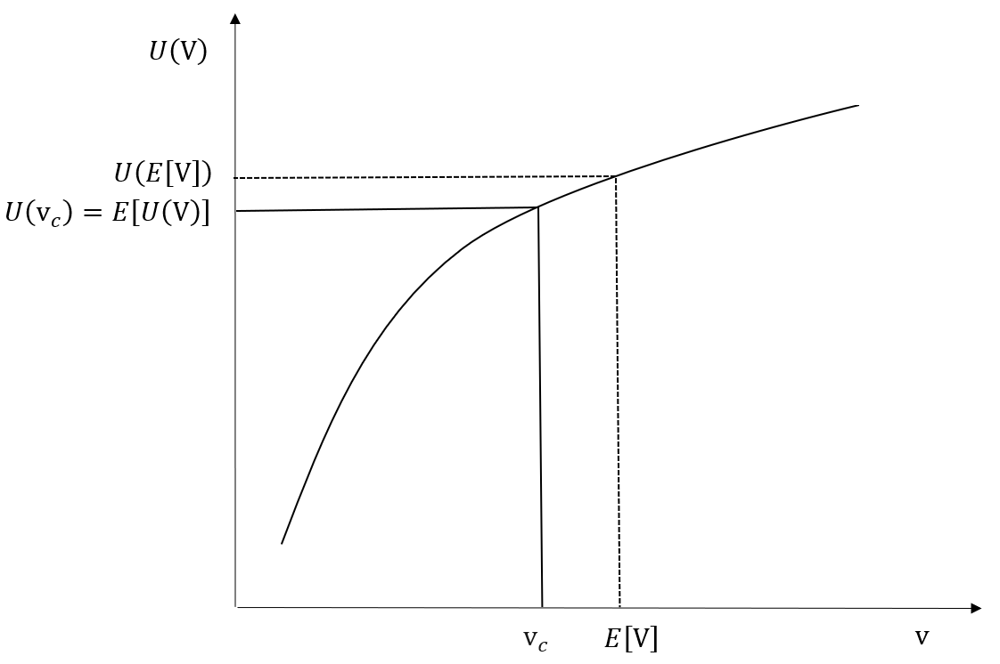

::: {.copyright-notice}
**Copyright Notice.** Planned for publication in 2026 by R. Douglas Martin, Thomas K. Philips, Bernd Scherer, and Kirk Li. All rights reserved. © Copyright 2025.
:::

::: {.pdf-callout}
::: {.pdf-icon}
&#128196;
:::
::: {.pdf-text}
**Full appendix available as PDF.**
[Download Appendix C — Utility Theory](Appendix%20C%20Utility%20Theory.pdf){target="_blank"}
:::
:::

## Overview

This appendix develops the theory of investor preferences and decision-making under uncertainty. Starting from the St. Petersburg paradox and von Neumann–Morgenstern axioms, it builds to expected utility maximization (EUM) and its connection with mean-variance optimization — the theoretical foundation on which PCRA rests.

---

## C.1 — Investor Preferences and Utility Functions

::: {.section-list}
**Topics covered:**

- The St. Petersburg paradox and Daniel Bernoulli's resolution via logarithmic utility
- Von Neumann–Morgenstern (VNM) axioms: Completeness, Transitivity, Substitution
- Cardinal utility functions $U(v)$ and their affine invariance
- Expected Utility Maximization (EUM) as the dominant paradigm for modeling rational choice
:::

The **von Neumann–Morgenstern theorem** states that if an investor's preferences satisfy the VNM axioms, there exists a utility function $U$ such that among any set of lotteries the investor prefers the one with the highest expected utility $\mathrm{E}[U(v)]$. The notation $X \succ Y$ denotes strict preference for lottery $X$ over $Y$; indifference is written $X \sim Y$.

---

## C.2 — Concave Utility Functions and Risk Aversion

::: {.section-list}
**Topics covered:**

- Concavity of $U$ as the formal definition of risk aversion
- Jensen's inequality: $U(\mathrm{E}[v]) \geq \mathrm{E}[U(v)]$ for concave $U$
- Common utility families: logarithmic, power (CRRA), exponential (CARA), quadratic
:::

A **risk-averse** investor has a concave utility function. By Jensen's inequality,
$$
U\!\bigl(\mathrm{E}[v]\bigr) \geq \mathrm{E}\!\bigl[U(v)\bigr],
$$
meaning they prefer the expected value of a lottery with certainty to participating in the lottery itself.

::: {#fig-concave-utility layout-ncol=1}
{fig-alt="Concave utility function and risk aversion"}

A concave utility function implies risk aversion: $U(\mathrm{E}[v]) > \mathrm{E}[U(v)]$.
:::

---

## C.3 — Certainty Equivalent Value and the Risk Premium

::: {.section-list}
**Topics covered:**

- Certainty equivalent $CE$: the certain wealth level that makes the investor indifferent to the lottery
- Risk premium $\pi = \mathrm{E}[v] - CE$: the maximum amount the investor will pay to avoid the risk
- Graphical and analytical derivation
:::

For a lottery with expected value $\mu_v$ and variance $\sigma_v^2$, the **certainty equivalent** $CE$ satisfies $U(CE) = \mathrm{E}[U(v)]$, and the **risk premium** is $\pi = \mu_v - CE > 0$ for a risk-averse investor.

::: {#fig-certainty-equivalent layout-ncol=1}
{fig-alt="Certainty equivalent diagram"}

Certainty equivalent $CE$ and risk premium $\pi = \mathrm{E}[v] - CE$.
:::

---

## C.4 — Absolute and Relative Risk Aversion

::: {.section-list}
**Topics covered:**

- Arrow–Pratt coefficient of **absolute risk aversion**: $A(v) = -U''(v)/U'(v)$
- Coefficient of **relative risk aversion**: $R(v) = v \cdot A(v) = -v\,U''(v)/U'(v)$
- CARA utility (constant absolute risk aversion): exponential family
- CRRA utility (constant relative risk aversion): power and logarithmic families
- How risk aversion coefficients govern portfolio choice
:::

The Arrow–Pratt measures provide operational definitions of how risk aversion changes with wealth:

| Utility family | $U(v)$ | $A(v)$ | $R(v)$ |
|---|---|---|---|
| Exponential (CARA) | $-e^{-\alpha v}$ | $\alpha$ (constant) | $\alpha v$ |
| Power (CRRA) | $v^{1-\gamma}/(1-\gamma)$ | $\gamma/v$ | $\gamma$ (constant) |
| Logarithmic | $\ln v$ | $1/v$ | $1$ (constant) |
| Quadratic | $v - \tfrac{b}{2}v^2$ | $b/(1-bv)$ | $bv/(1-bv)$ |

---

## C.5 — Expected Utility Maximization and Mean-Variance Optimization

::: {.section-list}
**Topics covered:**

- Conditions under which EUM implies mean-variance optimization
- Normally distributed returns: any utility function with EUM $\Rightarrow$ MVO
- Quadratic utility: MVO holds for any return distribution
- Limitations: when EUM and MVO diverge
:::

When returns are normally distributed or when the utility function is quadratic, Expected Utility Maximization is exactly equivalent to Mean-Variance Optimization — maximizing $\mu_P - \tfrac{\lambda}{2}\sigma_P^2$ for risk aversion parameter $\lambda$.

---

## C.6 — Expected Quadratic Utility and QP Optimization

::: {.section-list}
**Topics covered:**

- Quadratic utility $U(v) = v - \tfrac{b}{2}v^2$ and its expected value
- Derivation of the MVO objective from expected quadratic utility
- Quadratic programming (QP) formulation of the portfolio problem
:::

---

## C.7 — Objections to Utility Theory

::: {.section-list}
**Topics covered:**

- Allais paradox: systematic violations of the VNM independence axiom
- Ellsberg paradox: ambiguity aversion
- Prospect theory (Kahneman and Tversky): loss aversion and probability weighting
- Practical implications for portfolio management
:::

---

## C.8 — Making Utility Theory Practical

::: {.section-list}
**Topics covered:**

- Eliciting risk preferences from investors
- Connecting utility parameters to portfolio construction decisions
- Practical approximations and their domains of validity
:::

::: {.callout-note}
## Reading Guide

Sections C.1–C.4 develop the theoretical foundations. Section C.5 is the critical bridge to the mean-variance framework used throughout PCRA. Readers primarily interested in practical portfolio construction may read C.5–C.6 first, then refer back to C.1–C.4 as needed.
:::
