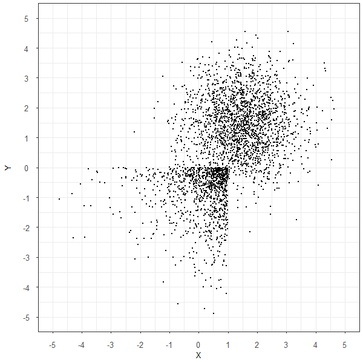
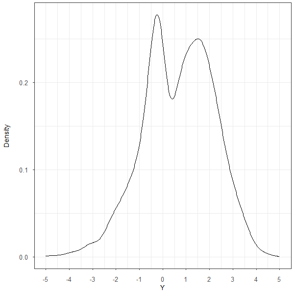
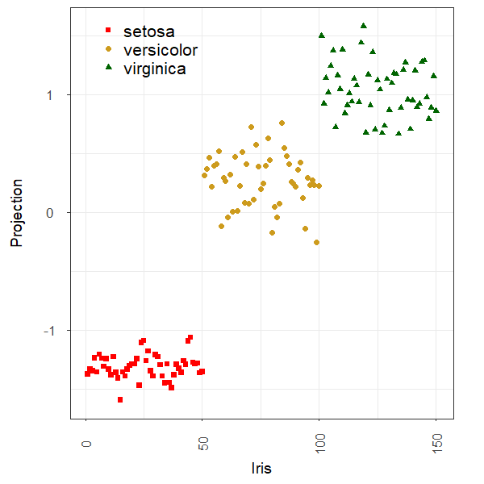

::: {.copyright-notice}
**Copyright Notice.** Planned for publication in 2026 by R. Douglas Martin, Thomas K. Philips, Bernd Scherer, and Kirk Li. All rights reserved. © Copyright 2025.
:::

::: {.pdf-callout}
::: {.pdf-icon}
&#128196;
:::
::: {.pdf-text}
**Full appendix available as PDF.**
[Download Appendix E — Machine Learning](Appendix%20E%20Machine%20Learning.pdf){target="_blank"}
:::
:::

## Overview

This appendix introduces the machine learning methods most relevant to portfolio management: regularized regression, cross-validation for model selection, robust variants of these methods, logistic regression for classification, and projection pursuit / neural network foundations.

The appendix situates ML within the broader statistical culture debate identified by @Breiman2001, who distinguishes data-driven models focused on goodness-of-fit from distribution-agnostic algorithms focused on predictive accuracy. Both cultures are represented in PCRA.

---

## E.1 — Overview of Machine Learning

::: {.section-list}
**Topics covered:**

- The two statistical cultures (Breiman 2001): model-based vs. algorithm-focused
- Supervised, unsupervised, and reinforcement learning
- Large Language Models (LLMs) and Generative AI in the context of finance
- Key references: @KellyXiu2023, @HastieTibshiraniFriedman2009, @GuKellyXiu2020
:::

Machine Learning, LLMs, and Generative AI are reshaping portfolio management. This appendix focuses on the subset of ML methods with direct relevance to return forecasting, factor model estimation, and risk management:

1. **Regularized regression** — feature selection and shrinkage in high-dimensional settings
2. **Robust regularized regression** — handling outliers in the same setting
3. **Classification** — distinguishing among discrete outcomes (e.g., market regimes)
4. **Projection pursuit and neural networks** — non-linear dimension reduction

---

## E.2 — Supervised Learning Using Regularized Classical Algorithms

### E.2.1 — Regularization

::: {.section-list}
**Topics covered:**

- Motivation: bias-variance trade-off in high-dimensional regression
- Penalized least squares: $\min_{\boldsymbol{\beta}} \|\mathbf{y} - \mathbf{X}\boldsymbol{\beta}\|^2 + \text{penalty}(\boldsymbol{\beta})$
- Shrinkage as a remedy for overfitting
:::

### E.2.2 — Ridge Regression

::: {.section-list}
**Topics covered:**

- Ridge penalty: $\text{penalty} = \lambda \|\boldsymbol{\beta}\|_2^2$
- Closed-form solution: $\hat{\boldsymbol{\beta}}_R = (\mathbf{X}^\prime\mathbf{X} + \lambda\mathbf{I})^{-1}\mathbf{X}^\prime\mathbf{y}$
- Degrees of freedom: $\mathrm{tr}[\mathbf{X}(\mathbf{X}^\prime\mathbf{X} + \lambda\mathbf{I})^{-1}\mathbf{X}^\prime]$
- Ridge as a Bayesian estimator with Gaussian prior
- Shrinkage path as $\lambda$ varies
:::

Ridge regression replaces the possibly ill-conditioned $(\mathbf{X}^\prime\mathbf{X})^{-1}$ with the well-conditioned $(\mathbf{X}^\prime\mathbf{X} + \lambda\mathbf{I})^{-1}$, shrinking all coefficients toward zero without setting any exactly to zero.

### E.2.3 — Lasso

::: {.section-list}
**Topics covered:**

- Lasso penalty: $\text{penalty} = \lambda \|\boldsymbol{\beta}\|_1$
- Sparsity: some coefficients are driven exactly to zero (automatic variable selection)
- LARS algorithm for the full regularization path
- Lasso as a Bayesian estimator with Laplace prior
:::

The $\ell_1$ penalty produces sparse solutions — many $\hat\beta_j = 0$ — making the Lasso a simultaneous estimator and variable selector. This is especially valuable when forecasting stock returns from a large universe of candidate factors.

### E.2.4 — The Elastic Net

::: {.section-list}
**Topics covered:**

- Combined penalty: $\lambda_1 \|\boldsymbol{\beta}\|_1 + \lambda_2 \|\boldsymbol{\beta}\|_2^2$
- Advantages over Lasso when predictors are correlated (groups selected together)
- The mixing parameter $\alpha \in [0,1]$: $\alpha = 1$ is Lasso, $\alpha = 0$ is Ridge
:::

### E.2.5 — Cross-Validation

::: {.section-list}
**Topics covered:**

- $k$-fold cross-validation for tuning $\lambda$
- Leave-one-out cross-validation (LOOCV)
- Time-series cross-validation: respecting temporal ordering to avoid look-ahead bias
:::

::: {.callout-warning}
## Time-Series Caution
Standard $k$-fold CV shuffles observations randomly, which induces look-ahead bias when data are time-ordered. In financial applications, always use **walk-forward** or **expanding-window** CV, where the validation set is always strictly later than the training set.
:::

---

## E.3 — Robust Regularized Regression

::: {.section-list}
**Topics covered:**

- Why OLS-based regularization fails in the presence of outliers
- Robust Ridge Regression: replacing the OLS loss with a robust $\rho$ loss
- Robust Lasso and Elastic Net
:::

### E.3.1 — Robust Ridge Regression

Robust ridge regression replaces the squared loss $\|\mathbf{y} - \mathbf{X}\boldsymbol{\beta}\|^2$ with a bounded loss function $\sum_i \rho(r_i/s)$, where $s$ is a robust scale estimate and $\rho$ is the mOpt or bisquare loss. The result combines the shrinkage properties of ridge with resistance to contamination.

### E.3.2 — Robust Lasso and Elastic Net

The Lasso and Elastic Net objectives can similarly be robustified by substituting a bounded $\rho$ function for the squared loss, producing estimators that are simultaneously sparse and resistant to outliers — properties that are both important in financial data.

---

## E.4 — Classification and Robust Logistic Regression

::: {.section-list}
**Topics covered:**

- Binary classification problems in finance (e.g., regime detection, default prediction)
- Classical logistic regression: log-likelihood and the logistic link function
- Robust logistic regression: bounded estimating equations to resist label noise and leverage points
:::

### E.4.1 — Logistic Regression

For a binary outcome $y_i \in \{0,1\}$, logistic regression models

$$
P(Y = 1 \mid \mathbf{x}) = \frac{1}{1 + e^{-\mathbf{x}^\prime\boldsymbol{\beta}}}.
$$

The MLE maximizes the log-likelihood
$\sum_i \bigl[y_i \log \hat{p}_i + (1-y_i)\log(1-\hat{p}_i)\bigr]$.

---

## E.5 — Projection Pursuit Regression and Neural Networks

::: {.section-list}
**Topics covered:**

- Projection pursuit: fitting additive ridge functions $\sum_k g_k(\boldsymbol{\alpha}_k^\prime \mathbf{x})$
- Finding optimal projection directions $\boldsymbol{\alpha}_k$ to reveal non-Gaussian structure
- Projection Pursuit Regression (PPR): supervised version for prediction
- Connection to shallow neural networks (one hidden layer)
:::

**Projection pursuit** (Friedman and Tukey, 1974) searches for low-dimensional projections of high-dimensional data that reveal interesting non-Gaussian structure. The index used to measure "interestingness" is typically based on the negentropy of the projected data.

::: {#fig-pp-data layout="[[1,1]]"}
{fig-alt="Scatter plot of x and y"}

{fig-alt="2d density plot"}

Input data: scatter and bivariate density of the projection pursuit example variables.
:::

::: {#fig-pp-marginals layout="[[1,1]]"}
{fig-alt="1d density of x"}

{fig-alt="1d density of y"}

Marginal densities of $x$ (left) and $y$ (right).
:::

::: {#fig-pp-unrotated layout-ncol=1}
{fig-alt="Projection pursuit unrotated"}

Projection pursuit: first unrotated projection direction.
:::

::: {#fig-pp-example layout-ncol=1}
{fig-alt="Projection pursuit example"}

Projection pursuit example: optimal rotation reveals hidden structure.
:::

::: {#fig-kurtosis layout-ncol=1}
{fig-alt="Kurtosis minimization plot"}

Kurtosis minimization as a projection pursuit index.
:::

### E.5.1 — Projection Pursuit

The projection pursuit model fits

$$
\hat{y} = \mu + \sum_{k=1}^{K} g_k(\boldsymbol{\alpha}_k^\prime \mathbf{x}),
$$

where each ridge function $g_k$ is estimated nonparametrically and each projection direction $\boldsymbol{\alpha}_k$ is chosen to maximize a projection index (e.g., negentropy or kurtosis). Successive terms are fitted to residuals, analogous to boosting.

### E.5.2 — Projection Pursuit Regression

In the supervised (regression) setting, the projection directions and ridge functions are estimated jointly to minimize prediction error. PPR is a universal approximator and a direct precursor to the single-hidden-layer neural network.

::: {.callout-note}
## Reading Guide

Readers familiar with OLS and logistic regression can proceed directly to E.3 (robust variants) and E.5 (projection pursuit), returning to E.2 as a reference. Section E.2.5 (cross-validation) should be read carefully by anyone applying regularized methods to financial time series, because the temporal ordering of data requires special CV protocols.
:::
